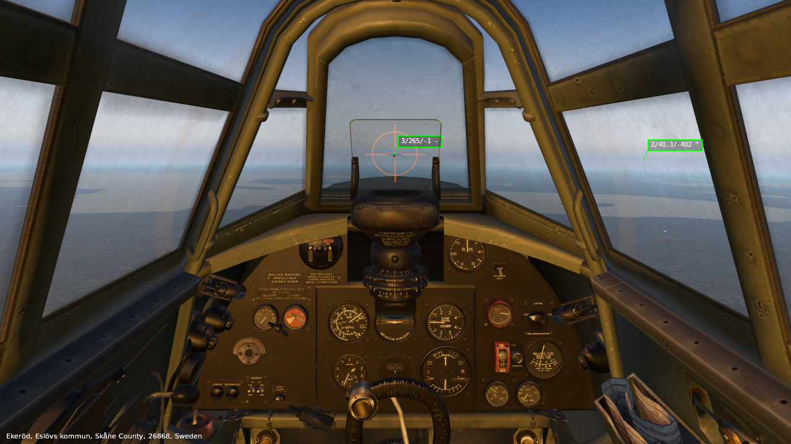
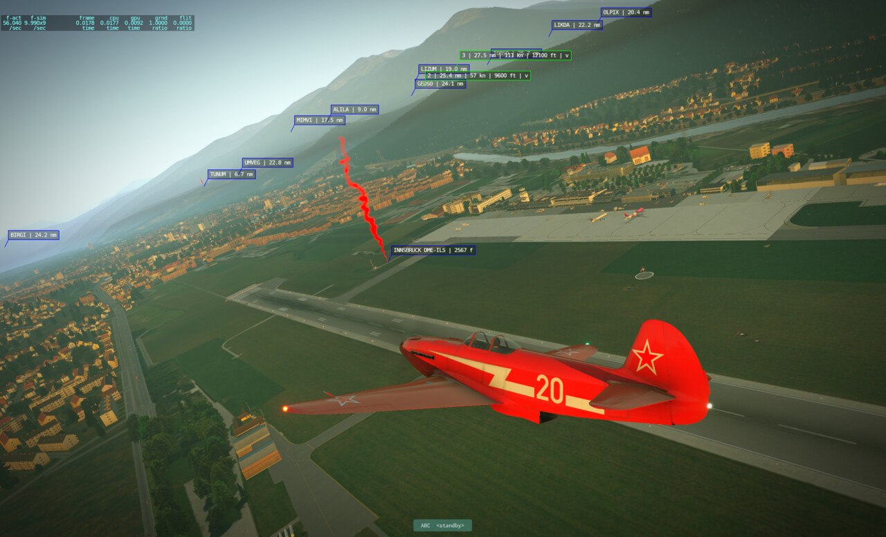

# X-Label

Draws info about AI aircraft on the screen (on top of everything else).



The box shows the AI aircraft number, the distance in kilometers, or in meters if less than 5 kms, and the altitude difference with your aircraft. The last symbol shows the vertical speed direction of the target plane.

Can display distance to points of interest in a similar manner. This slows down X-plane a lot.

Can put a smoke emitting object at the nearest airport (needs to be defined in the configuration file).

Distance can be shown in metric or imperial units.

Possibility to warp the user aircraft to the first AI aircraft, copying position, speed and orientation.

# Usage

This plugin has no menu or userinterface. There are seven commands you can assign to a keyboard key or joystick button. Search for "durian/xlabel" in the keyboard assignment menu in X-Plane.

 - durian/xlabel/toggle_ac_label: shows the AI aircraft labels
 - durian/xlabel/toggle_ap_label: shows the POI labels
 - durian/xlabel/toggle_ap_smoker: puts smoke at the nearest airport
 - durian/xlabel/toggle_units: switch between metric/imperial
 - durian/xlabel/warp_to_next_ai: Warp user aicraft to next AI aircraft
 - durian/xlabel/warp_to_prev_ai: Warp user aircraft to previous AI aircraft
 - durian/xlabel/warp_to_closest_ai: Warp user aircraft to closest AI aircraft

## POIs

The following shows a screenshot using a database with Swedish cities.


Note that if you increase the number and distance, the view becomes cluttered.


## Kitchensink

The following screen shot shows the labels for Ai aircraft, POIs and a smoke marker on the airport.


## Installing POIs

In `Output/preferences/`, `xlabel_pois.txt`.

```
# LAT      LON        ALT DIST  LABEL
56.292109, 12.854471, 0,   10000, ESTA
56.338259, 12.895436, 0,    5000, Margretetorp
```

## Smoker

In `Output/preferences/`, `xlabel.obj` and `xlabel.pss`.

